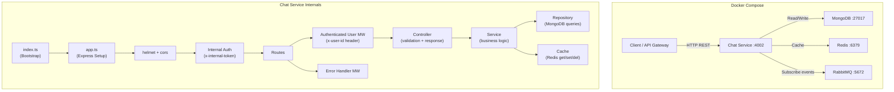

# Walkthrough: Chat Service — Cấu trúc & Flow

## 1. Đã làm gì

### Chuyển pnpm → npm
- Xóa `pnpm-workspace.yaml`, `pnpm-lock.yaml`
- Thêm `"workspaces"` vào root `package.json` (npm workspaces)
- Đổi `@chatapp/common: "workspace:^"` → `"file:../../packages/common"`
- Xóa `"packageManager": "pnpm@..."` ở tất cả package.json
- Cập nhật Dockerfile: `pnpm install` → `npm ci`, `pnpm --filter` → `npm run build --workspace=`
- ✅ `npm install` + `npm run build` thành công cho cả common và chat-service

---

## 2. Cấu trúc project hiện tại

```
chatapp-yt/
├── package.json                 # Root workspace (npm workspaces)
├── tsconfig.base.json           # Shared TypeScript config
├── tsconfig.json                # Project references (common + chat-service)
├── docker-compose.yml           # MongoDB + Redis + RabbitMQ + chat-service
├── .env.example                 # Environment variables template
├── prettier.config.cjs          # Code formatter config
│
├── packages/
│   └── common/                  # 📦 Shared library (@chatapp/common)
│       ├── package.json
│       ├── tsconfig.json
│       └── src/
│           ├── index.ts         # Re-exports everything
│           ├── env.ts           # createEnv() — validates env vars with Zod
│           ├── logger.ts        # createLogger() — structured logging (pino)
│           ├── errors/
│           │   └── http-error.ts    # HttpError class (statusCode + message)
│           ├── http/
│           │   ├── auth.ts              # AuthenticatedUser type + USER_ID_HEADER
│           │   ├── async-handler.ts     # asyncHandler() — wraps async routes
│           │   ├── validate-request.ts  # validateRequest() — Zod validation middleware
│           │   └── internal-auth.ts     # createInternalAuthMiddleware() — inter-service auth
│           └── events/
│               ├── event-types.ts   # DomainEvent, OutboundEvent types
│               └── user-events.ts   # UserCreatedEvent type + routing keys
│
└── services/
    └── chat-service/            # 💬 Chat Service (Express + MongoDB + Redis)
        ├── package.json
        ├── tsconfig.json
        ├── Dockerfile
        └── src/
            ├── index.ts                  # Entry point — bootstrap & graceful shutdown
            ├── app.ts                    # Express app setup (middleware chain)
            ├── config/
            │   └── env.ts                # Environment validation schema
            ├── clients/
            │   ├── mongo.client.ts       # MongoDB singleton connection
            │   └── redis.client.ts       # Redis singleton connection (ioredis)
            ├── middleware/
            │   ├── authenticated-user.ts # Extract user from x-user-id header
            │   └── error-handler.ts      # Global error → JSON response
            ├── routes/
            │   ├── index.ts              # Route registration + /health
            │   └── conversation.routes.ts # REST endpoints definition
            ├── controllers/
            │   └── conversation.controller.ts # Request handling + validation
            ├── services/
            │   ├── conversation.service.ts    # Business logic (conversations)
            │   └── message.service.ts         # Business logic (messages)
            ├── repositories/
            │   ├── conversation.repository.ts # MongoDB CRUD (conversations)
            │   ├── message.repository.ts      # MongoDB CRUD (messages)
            │   └── user.repository.ts         # MongoDB upsert (users từ events)
            ├── cache/
            │   └── conversation.cache.ts      # Redis cache (conversation)
            ├── messaging/
            │   └── rabbitmq.consumer.ts       # RabbitMQ listener (user.created)
            ├── validation/
            │   ├── conversation.schema.ts     # Zod schemas (conversation input)
            │   ├── message.schema.ts          # Zod schemas (message input)
            │   └── shared.schema.ts           # Zod schemas (shared params)
            ├── types/
            │   ├── conversation.ts            # Conversation interfaces
            │   ├── message.ts                 # Message interfaces
            │   └── express.d.ts               # Express Request augmentation
            └── utils/
                ├── auth.ts                    # getAuthenticatedUser() helper
                └── logger.ts                  # Logger instance
```

---

## 3. Kiến trúc tổng quan



---

## 4. Flow chi tiết

### 4.1 Khởi động (Bootstrap)

[index.ts](file:///Users/tungduong/my-project/se361/chatapp-yt/services/chat-service/src/index.ts) — Entry point:

```
main()
 ├── Connect MongoDB        (mongo.client.ts)
 ├── Connect Redis           (redis.client.ts)  
 ├── Start RabbitMQ Consumer (rabbitmq.consumer.ts)
 ├── Create Express App      (app.ts)
 ├── Listen on port 4002
 └── Register SIGINT/SIGTERM → graceful shutdown
```

### 4.2 Middleware chain (mỗi HTTP request)

[app.ts](file:///Users/tungduong/my-project/se361/chatapp-yt/services/chat-service/src/app.ts) — Thứ tự middleware:

```
Request đến
  │
  ├─ 1. helmet()                    — Security headers
  ├─ 2. cors({ origin: '*' })       — CORS
  ├─ 3. express.json()              — Parse JSON body
  ├─ 4. express.urlencoded()        — Parse URL-encoded body
  ├─ 5. internalAuthMiddleware      — Check x-internal-token header
  │     (exempt: /health)             Nếu token sai → 401
  ├─ 6. Routes
  │     ├─ GET /health              — Health check (không cần auth)
  │     └─ /conversations/*         — Conversation routes
  │           └─ attachAuthenticatedUser  — Extract x-user-id → req.user
  ├─ 7. 404 handler                 — Route không tìm thấy
  └─ 8. errorHandler                — Catch all errors → JSON response
```

### 4.3 API Endpoints

| Method | Path | Mô tả | Validation |
|--------|------|--------|------------|
| `GET` | `/health` | Health check | Không cần auth |
| `POST` | `/conversations` | Tạo conversation mới | `{ title?, participantIds: uuid[] }` |
| `GET` | `/conversations` | Liệt kê conversations | `?participantId=uuid` |
| `GET` | `/conversations/:id` | Lấy conversation theo ID | `id: uuid` |
| `POST` | `/conversations/:id/messages` | Gửi message | `{ body: string }` |
| `GET` | `/conversations/:id/messages` | Liệt kê messages | `?limit=number&after=datetime` |

### 4.4 Flow tạo conversation (ví dụ)

```
POST /conversations { title: "Group Chat", participantIds: ["uuid1"] }
  │
  ├─ [middleware] internalAuthMiddleware → check x-internal-token ✓
  ├─ [middleware] attachAuthenticatedUser → extract x-user-id → req.user
  ├─ [route] validateRequest({ body: createConversationSchema }) → Zod parse
  ├─ [controller] createConversationHandler
  │     ├── getAuthenticatedUser(req) → get current user
  │     ├── Merge participantIds + current user.id → deduplicate
  │     ├── Check ≥ 2 participants
  │     └── conversationService.createConversation(...)
  │           ├── conversationRepository.create(...)   → INSERT into MongoDB
  │           └── conversationCache.set(...)            → Cache in Redis (TTL 60s)
  └─ Response: 201 { data: conversation }
```

### 4.5 Flow gửi message

```
POST /conversations/:id/messages { body: "Hello!" }
  │
  ├─ [controller] createMessageHandler
  │     ├── conversationService.getConversationById(id)
  │     │     ├── conversationCache.get(id)    → Try Redis first
  │     │     └── conversationRepository.findById(id) → Fallback MongoDB
  │     ├── Check sender is participant → 403 if not
  │     ├── messageRepository.create(...)       → INSERT message into MongoDB
  │     └── conversationService.touchConversation(id, preview)
  │           ├── conversationRepository.touchConversation(...) → Update lastMessageAt/Preview
  │           └── conversationCache.delete(id)  → Invalidate cache
  └─ Response: 201 { data: message }
```

### 4.6 RabbitMQ Consumer (background)

```
RabbitMQ Exchange: "user.events" (topic)
  │
  └─ Queue: "chat-service.user-events"
       └─ Routing key: "user.created"
            └─ handleUserCreated(event)
                 └─ userRepository.upsertUser(payload) → MongoDB upsert vào collection "users"
```

> [!NOTE] 
> Consumer này lắng nghe khi có user mới được tạo (từ service khác) và lưu 1 bản copy vào MongoDB của chat-service. Hiện chưa có service nào phát event này (vì đã xóa user-service), nhưng code được giữ lại để sẵn sàng khi service mới phát event tương tự.

---

## 5. Databases & Data

### MongoDB (3 collections)
| Collection | Mô tả | Key fields |
|------------|--------|------------|
| `conversations` | Danh sách cuộc hội thoại | `_id`, `title`, `participantIds[]`, `lastMessageAt`, `lastMessagePreview` |
| `messages` | Tin nhắn trong conversation | `_id`, `conversationId`, `senderId`, `body`, `createdAt`, `reactions[]` |
| `users` | Bản copy user (từ events) | `_id`, `email`, `displayName`, `createdAt`, `updatedAt` |

### Redis
| Key pattern | TTL | Mô tả |
|-------------|-----|--------|
| `conversation:{id}` | 60s | Cache conversation object |

---

## 6. Packages/Common — Shared Library

`@chatapp/common` cung cấp các utilities dùng chung:

| Export | Mô tả |
|--------|--------|
| `HttpError` | Error class với statusCode (400, 404, 500...) |
| `asyncHandler()` | Wraps async Express handlers, forwards errors to next() |
| `validateRequest()` | Middleware validate body/params/query bằng Zod schemas |
| `createInternalAuthMiddleware()` | Middleware check internal token giữa các services |
| `createEnv()` | Validate env vars bằng Zod schema |
| `createLogger()` | Tạo pino logger instance |
| `AuthenticatedUser` | Type `{ id: string, email?: string }` |
| `USER_ID_HEADER` | Constant `"x-user-id"` |
| `z` (from Zod) | Re-export Zod cho validation |
| `Logger` (from Pino) | Re-export Pino Logger type |
| Event types | `UserCreatedEvent`, `UserCreatedPayload`, routing keys |

---

## 7. Chạy project

```bash
# Install
npm install

# Build common trước, rồi chat-service
npm run build --workspace=packages/common
npm run build --workspace=services/chat-service

# Dev mode (hot reload)
npm run dev --workspace=services/chat-service

# Docker
docker compose up -d
```

## 8. Verified

- ✅ `npm install` — 321 packages, 0 vulnerabilities
- ✅ `npm run build --workspace=packages/common` — OK
- ✅ `npm run build --workspace=services/chat-service` — OK
