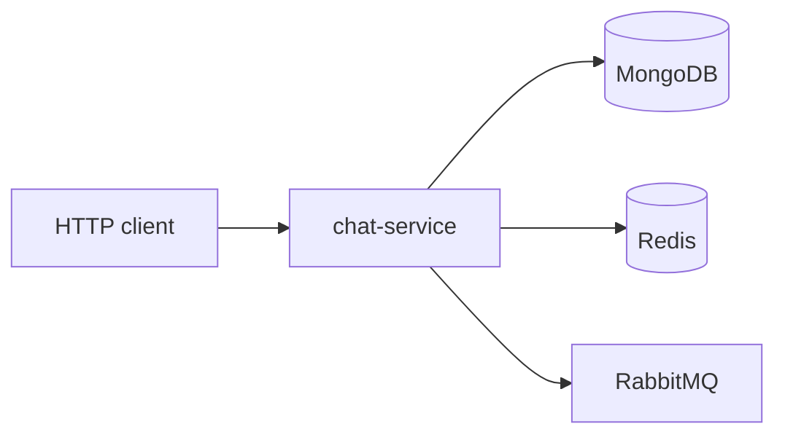

# chatapp-conversation

Monorepo: **`@chatapp/common`** + **chat-service** (Express, MongoDB, Redis, RabbitMQ). API REST cho cuộc hội thoại và tin nhắn; xác thực nội bộ bằng `x-internal-token`, ngữ cảnh người dùng bằng `x-user-id` (UUID).

## Cấu trúc

```text
chatapp-conversation/
├── packages/common/          # shared types, Zod env, HTTP helpers, event schemas
├── services/chat-service/    # ứng dụng chính
├── docker-compose.yml        # mongo, redis, rabbitmq, chat-service
└── .env.example
```

Luồng khởi động: kết nối Mongo + Redis; nếu có `RABBITMQ_URL` thì bật consumer (`user.created`) và publisher (`message.created`); sau đó HTTP trên `CHAT_SERVICE_PORT` (mặc định **4000**).

## Kiến trúc (Docker)



## HTTP

- **`GET /health`** — không cần token.
- **Còn lại** — header **`x-internal-token`** (trùng `INTERNAL_API_TOKEN`).
- **`/conversations/*`** và **`/presence/*`** — thêm **`x-user-id`**.

### Conversations (`/conversations`)

| Method | Path | Mô tả |
|--------|------|--------|
| POST | `/` | Tạo: `{ title?, participantIds[] }` |
| GET | `/` | List, query `?participantId=` |
| GET | `/:id` | Chi tiết |
| POST | `/:id/messages` | Gửi: `{ body }` |
| GET | `/:id/messages` | List, `limit`, `after` |
| POST | `/:id/receipts/notify-received` | `messageIds` |
| POST | `/:id/receipts/delivered` | `messageIds` |
| POST | `/:id/receipts/read` | `lastReadMessageId` |

### Presence (`/presence`)

| Method | Path | Mô tả |
|--------|------|--------|
| POST | `/` | Heartbeat |
| DELETE | `/` | Xóa presence |

### Nội bộ (`/internal`)

| Method | Path | Mô tả |
|--------|------|--------|
| POST | `/conversations/:id/receipts/notified` | `{ messageId, recipientUserIds[] }` — ghi `notifiedAt` cho recipient đang trong trạng thái “online” (theo `user_presence`) |
| POST | `/conversations/:id/receipts/delivery-ack` | `{ messageId, recipientUserId }` — ack từng người (push / pipeline), không phụ thuộc presence |

Tin **đi** có trường `receiptStatus` (`sent` | `delivered` | `read`) khi list messages; dữ liệu nằm trong collection **`message_receipts`**. Gửi tin thành công thì publish sự kiện **`message.created`** lên exchange **`conversation.events`** (khi RabbitMQ bật và `ENABLE_EVENT_PUBLISH` không tắt).

Cache conversation trên Redis được làm mới sau mỗi lần đọc hợp lệ từ Mongo; cache bị xóa khi conversation không tồn tại.

## MongoDB (gợi ý)

| Collection | Vai trò |
|------------|---------|
| `conversations` | Hội thoại |
| `messages` | Tin |
| `message_receipts` | notified / delivered / read theo `(messageId, userId)` |
| `user_presence` | Heartbeat |
| `users` | Đồng bộ từ event `user.created` |

## RabbitMQ

| Chiều | Exchange | Routing key | Ghi chú |
|--------|-----------|-------------|---------|
| Consume | `user.events` | `user.created` | Queue `chat-service.user-events` |
| Publish | `conversation.events` | `message.created` | Payload: `MessageCreatedEvent` trong `@chatapp/common` |

Không có `RABBITMQ_URL` → consumer và publisher không chạy.

## Biến môi trường

Xem `.env.example`.

| Biến | Mô tả |
|------|--------|
| `CHAT_SERVICE_PORT` | Mặc định `4000` |
| `MONGO_URL` | MongoDB |
| `REDIS_URL` | Redis |
| `RABBITMQ_URL` | Tuỳ chọn |
| `ENABLE_EVENT_PUBLISH` | `false`/`0` để tắt publish; mặc định bật khi có broker |
| `INTERNAL_API_TOKEN` | ≥ 16 ký tự |
| `JWT_SECRET` | ≥ 32 ký tự (schema env) |

## Chạy

```bash
npm install
npm run build --workspace=packages/common
npm run build --workspace=services/chat-service
npm run dev --workspace=services/chat-service
```

Docker: `docker compose up -d`. Mạng Docker tên **`chatapp-network`** — dùng chung với các service khác trong cùng máy/host.
